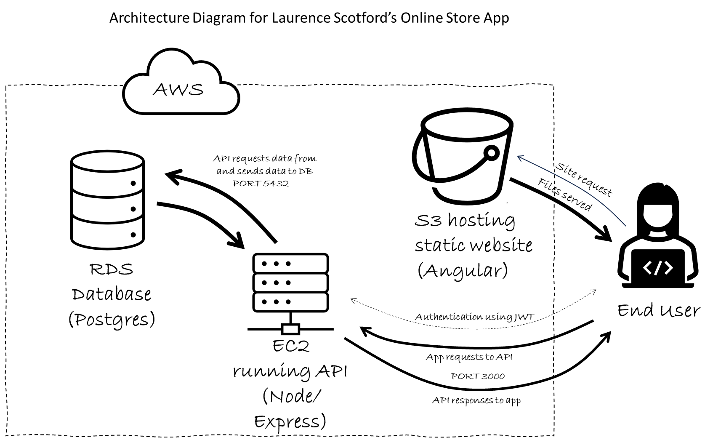
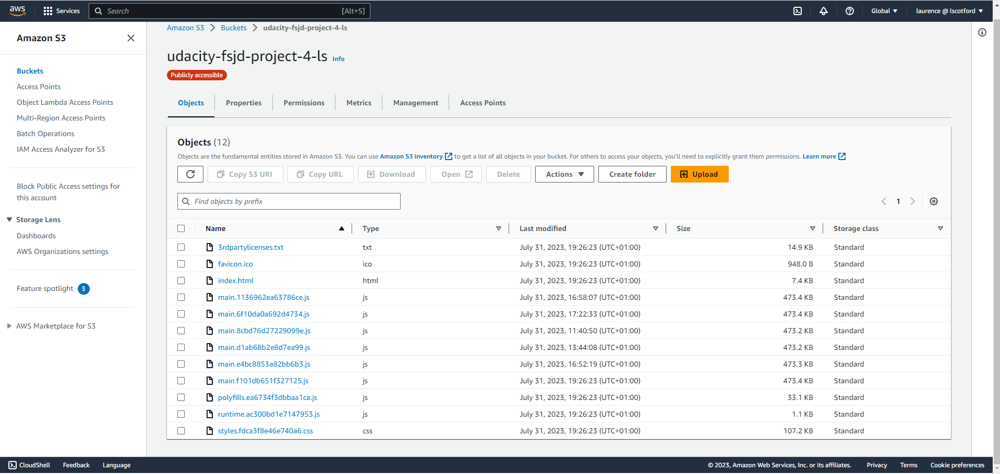
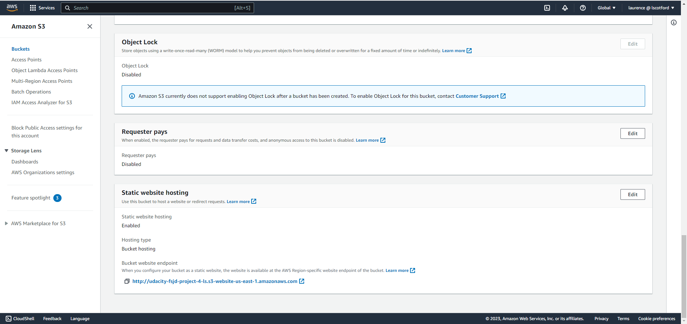
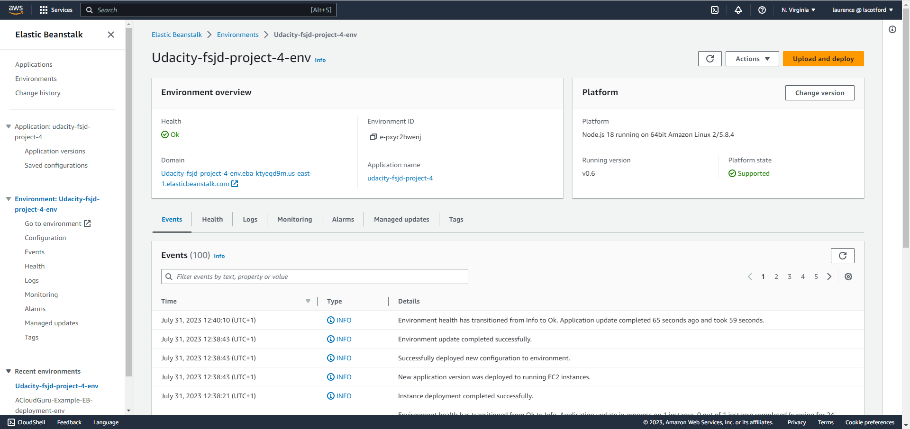
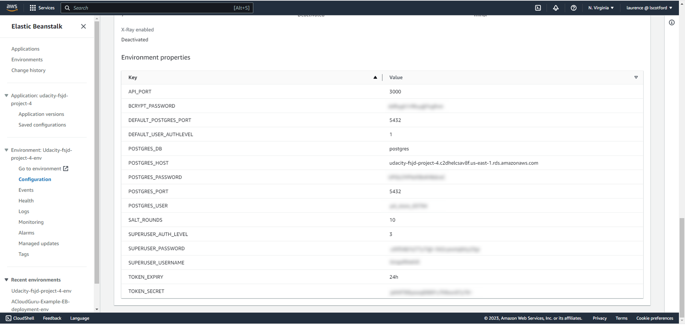
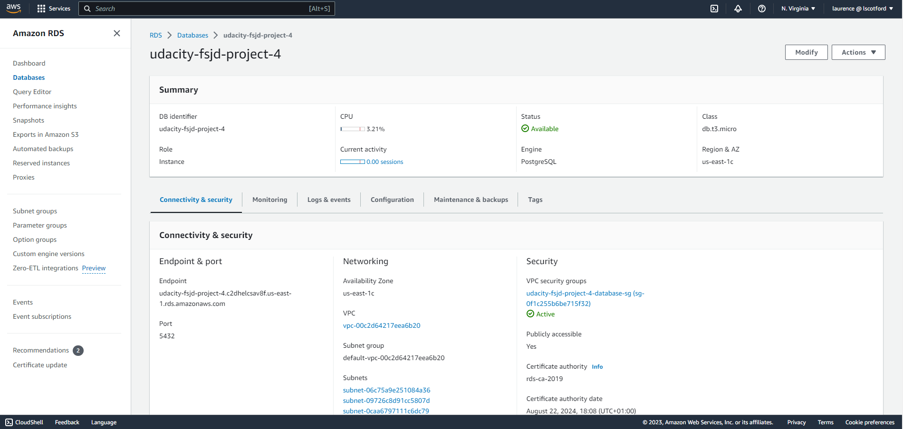
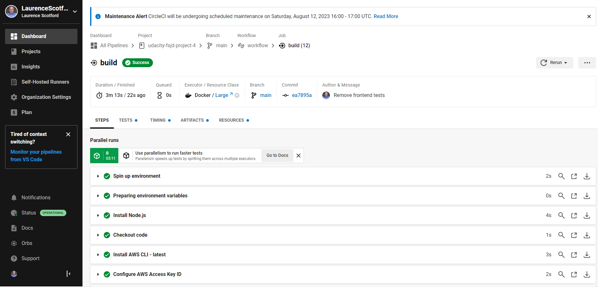

# Udacity Full Stack JavaScript Developer Nanodegree - Project 4 Submission

**NOTE:** Please use Markdown preview to see the embedded images - or you can view them individually within the images folder.

## Architecture


I have used modified and integrated versions of my Project 2 (Backend API) and Project 3 (Frontend app). The frontend app was built with Angular and ngrx to handle application state and messaging between modules. The built app is stored in an AWS S3 bucket configured as a static website (see images below):




This app sends requests (via Port 3000) to an API created as a Node/Express app which is running on AWS EC2 instances. This app is managed and deployed using Elastic Beanstalk.

Authorisation is handled between the frontend app and the API through the use of JavaScript Web Tokens (JWTs). Otherwise, this is a standard REST API.




The API stores and retrieves data in a Postgres database running in AWS RDS.


You can find more technical details about the frontend and backend apps by referring to the README files in the respective folders of this repository.

## CD/CI Pipeline
App deployment is managed using the CircleCI service.


When a new version is pushed to the repository, the pipeline sets up some essential software - Node, the AWS CLI and EB CLI, then completes a checkout of the code before installing, building and deploying the apps.

The frontend app is deployed using a CLI command to upload the build files to the AWS S3 bucket. The backend app is deployed using an EB CLI command to upload a zipfile of the build files to the EB environment, where it is unzipped and deployed.



## Running the app
You can try the deployed app by visiting: [http://udacity-fsjd-project-4-ls.s3-website-us-east-1.amazonaws.com/](http://udacity-fsjd-project-4-ls.s3-website-us-east-1.amazonaws.com/)

When you first visit the app you will see the products page with the available products in the store. You are free to browse and add items to your cart without registering or logging in, but you won't be able to complete an order until you do register and/or login.

By all means register a new account (there is no email verification in this version, so you can just use a fake email). Alternatively, you can login as an existing account:

```
username: testuser
password: shopper123
```

After you have logged in, if you go to the Cart screen, you can now complete your order. Please note the credit card field will happily accept any 16 digit number, so there is no need to use a real credit card.

Currently there is no admin app for viewing or processing orders, so any new orders will just sit as unfulfilled orders in the database forever. Although, it wasn't a requirement for this course, I may build an admin backend later for my own satisfaction. 