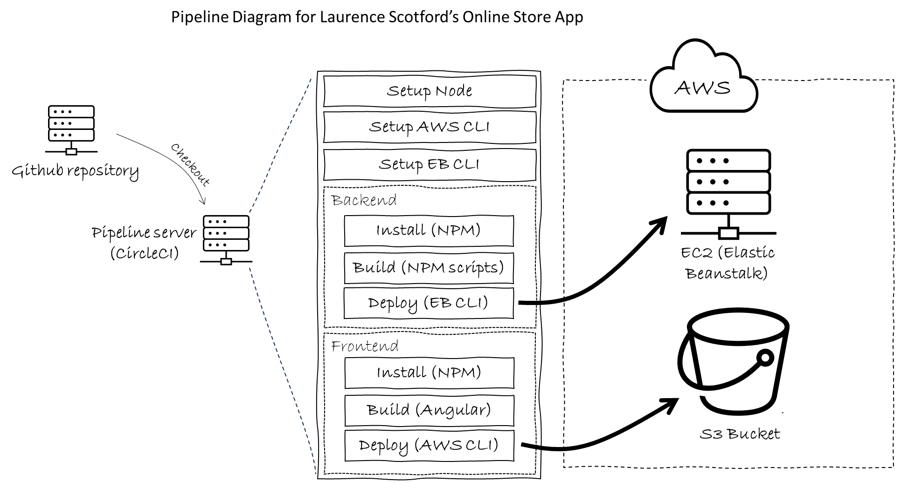
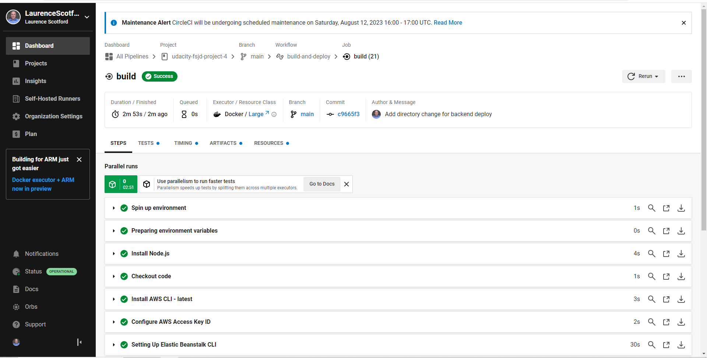
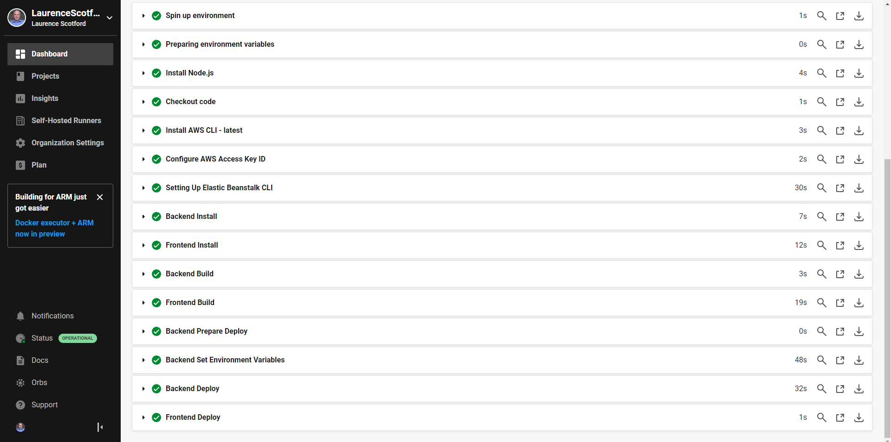

# CD/CI Pipeline
App deployment is managed using the CircleCI service.

When a new version is pushed to the **main** branch of the repository, the pipeline sets up some essential software - Node, the AWS CLI and EB CLI, then completes a checkout of the code before installing, building and deploying the apps.

**Please note:** The **develop** branch should be used for building and testing new features, as commits to this branch will not trigger redeployment. When updates on the development branch have been approved, they can be merged into the **main** branch to trigger redeployment.

The frontend app is deployed using a CLI command to upload the build files to the AWS S3 bucket. The backend app is deployed using an EB CLI command to upload a zipfile of the build files to the EB environment, where it is unzipped and deployed.

