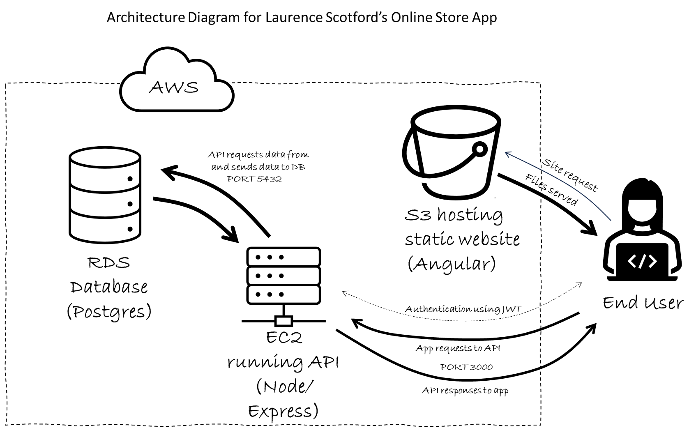
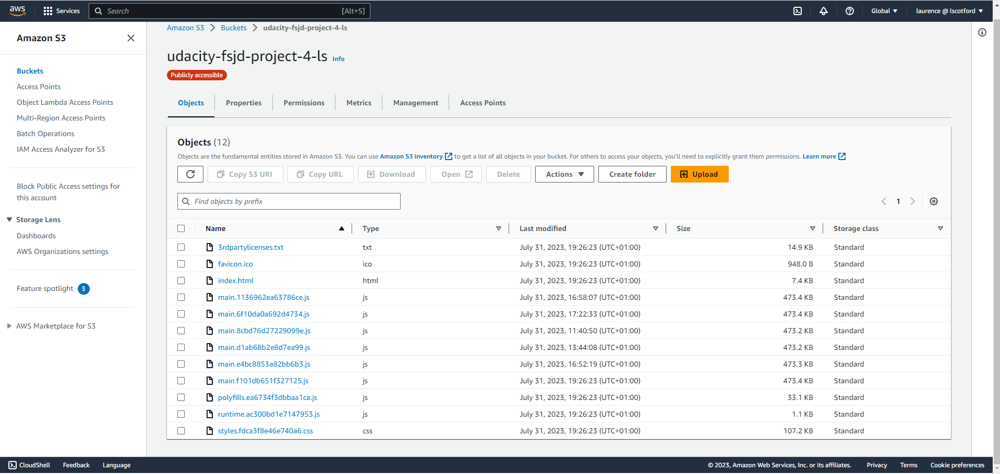
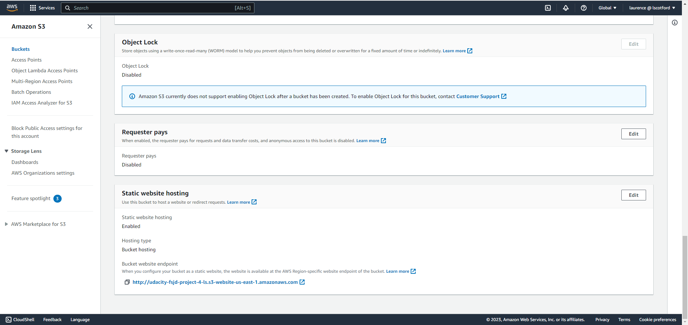
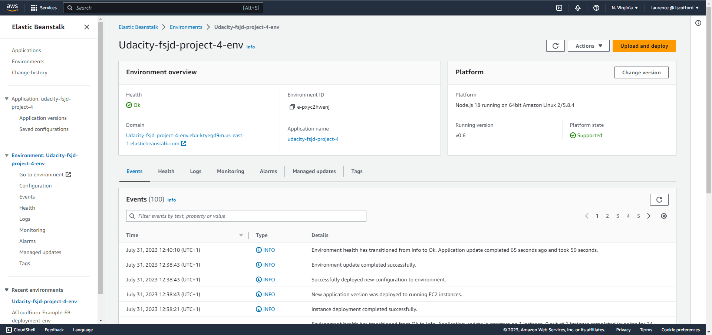
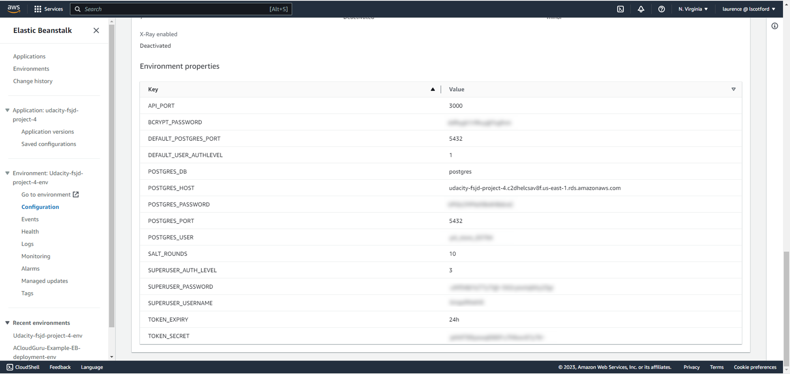
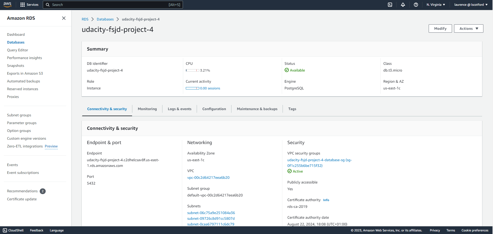

# Project Architecture

I have used modified and integrated versions of my Project 2 (Backend API) and Project 3 (Frontend app). The frontend app was built with Angular and ngrx to handle application state and messaging between modules. The built app is stored in an AWS S3 bucket configured as a static website (see images below):

This app sends requests (via Port 3000) to an API created as a Node/Express app which is running on AWS EC2 instances. This app is managed and deployed using Elastic Beanstalk.

Authorisation is handled between the frontend app and the API through the use of JavaScript Web Tokens (JWTs). Otherwise, this is a standard REST API.

The API stores and retrieves data in a Postgres database running in AWS RDS.

You can find more technical details about the frontend and backend apps by referring to the other files in the documents folder of this repository.